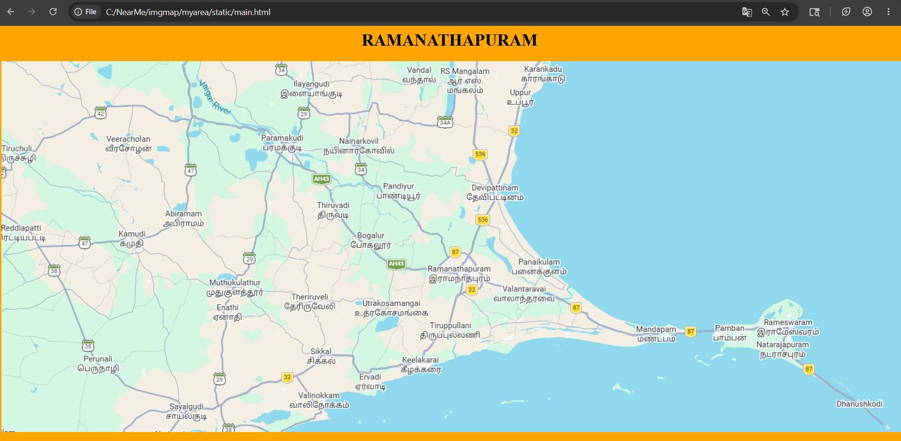
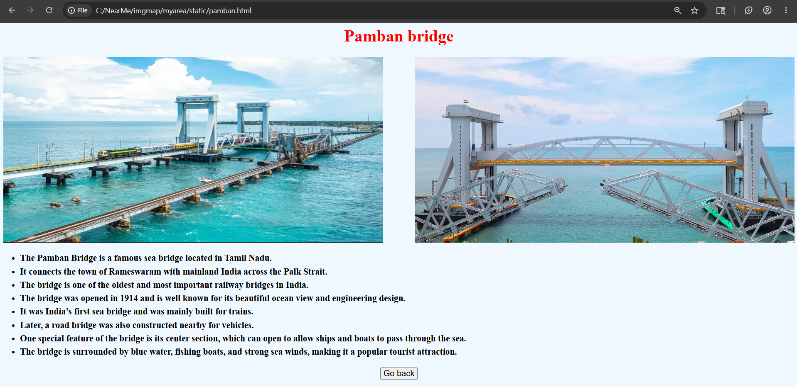
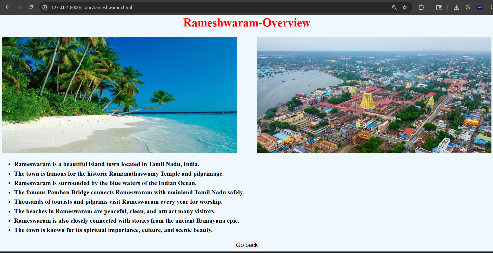
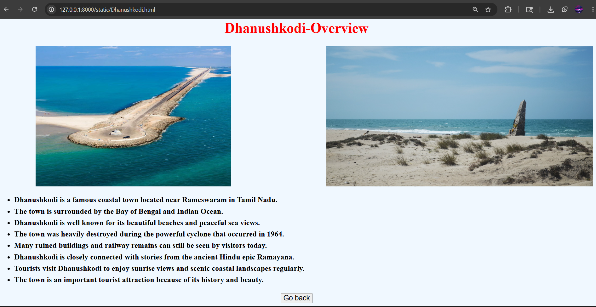
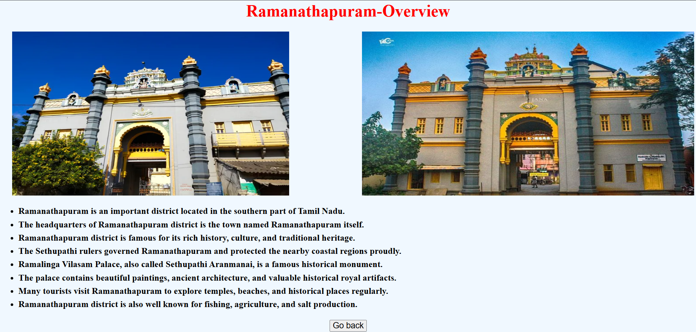
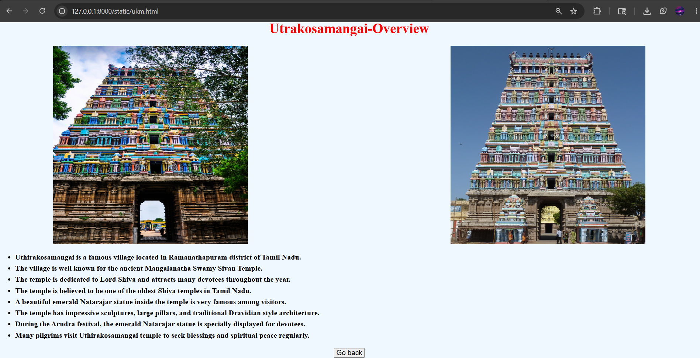

# Ex03 Places Around Me
## Date: 17-05-2026

## AIM
To develop a website to display details about the places around my house.

## DESIGN STEPS

### STEP 1
Create a Django admin interface.

### STEP 2
Download your city map from Google.

### STEP 3
Using ```<map>``` tag name the map.

### STEP 4
Create clickable regions in the image using ```<area>``` tag.

### STEP 5
Write HTML programs for all the regions identified.

### STEP 6
Execute the programs and publish them.

## CODE

## main.html

```html
<html>
    <head>
        <title>
            Img Map for My Area
        </title>
    </head>
    <body bgcolor="orange">
        <h1 align="center"><b>RAMANATHAPURAM</b></h1>
        <center>
        <map name="imgmap">
            <area href="pamban.html" coords="1282,541,1341,495" shape="rect" alt="Pamban Bridge">
            <area href="rameshwaram.html" coords="1433,478,1538,526" shape="rect" alt="Rameshwaram - Overview">
            <area href="Dhanushkodi.html" coords="1538,684,1682,619" shape="rect" alt="Dhanushkodi">
            <area href="ramnad.html" coords="792,432,934,362" shape="rect" alt="Ramanathapuram - Overview">
            <area href="ukm.html" coords="660,502,810,441" shape="rect" alt="Utrakosamangai - Overview">
        </map></center>
    </body>
</html>
```

## pamban.html
```html
<html>
    <head>
        <title>
            Pamban Bridge
        </title>
    </head>
    <body bgcolor="aliceblue">
        <center><h1 style="font-size: 40px;color:red;"><b>Pamban bridge</b></h1></center>
        
        <br clear="all">
        <ul style="font-size: 21.5px;font-weight:bolder;line-height: 1.5;">
            <li>The Pamban Bridge is a famous sea bridge located in Tamil Nadu.</li>
            <li>It connects the town of Rameswaram with mainland India across the Palk Strait. </li>
            <li>The bridge is one of the oldest and most important railway bridges in India.</li>
            <li>The bridge was opened in 1914 and is well known for its beautiful ocean view and engineering design. </li>
            <li>It was India’s first sea bridge and was mainly built for trains. </li>
            <li>Later, a road bridge was also constructed nearby for vehicles.</li>
            <li>One special feature of the bridge is its center section, which can open to allow ships and boats to pass through the sea. </li>
            <li>The bridge is surrounded by blue water, fishing boats, and strong sea winds, making it a popular tourist attraction.</li>
        </ul>
        <center>
            <a href="main.html">
                <button style="font-size: 20px;">
                    Go back
                </button>
            </a>
        </center>
    </body>
</html>
```

## rameshwaram.html
```html
<html>
    <head>
        <title>
            Rameshwaram
        </title>
    </head>
    <body bgcolor="aliceblue">
        <center><h1 style="font-size: 40px;color:red;"><b>Rameshwaram-Overview</b></h1></center>
        
        <br clear="all">
        <ul style="font-size: 21.5px;font-weight:bolder;line-height: 1.5;">
            <li>Rameswaram is a beautiful island town located in Tamil Nadu, India.</li>
            <li>The town is famous for the historic Ramanathaswamy Temple and pilgrimage.</li>
            <li>Rameswaram is surrounded by the blue waters of the Indian Ocean.</li>
            <li>The famous Pamban Bridge connects Rameswaram with mainland Tamil Nadu safely.</li>
            <li>Thousands of tourists and pilgrims visit Rameswaram every year for worship.</li>
            <li>The beaches in Rameswaram are peaceful, clean, and attract many visitors.</li>
            <li>Rameswaram is also closely connected with stories from the ancient Ramayana epic.</li>
            <li>The town is known for its spiritual importance, culture, and scenic beauty.</li>
        </ul>
        <center>
            <a href="main.html">
                <button style="font-size: 20px;">
                    Go back
                </button>
            </a>
        </center>
    </body>
</html>
```

## ramnad.html

```html
<html>
    <head>
        <title>
            Ramanathapuram
        </title>
    </head>
    <body bgcolor="aliceblue">
        <center><h1 style="font-size: 40px;color:red;"><b>Ramanathapuram-Overview</b></h1></center>
        
        <br clear="all">
        <ul style="font-size: 21.5px;font-weight:bolder;line-height: 1.5;">
            <li>Ramanathapuram is an important district located in the southern part of Tamil Nadu.</li>
            <li>The headquarters of Ramanathapuram district is the town named Ramanathapuram itself.</li>
            <li>Ramanathapuram district is famous for its rich history, culture, and traditional heritage.</li>
            <li>The Sethupathi rulers governed Ramanathapuram and protected the nearby coastal regions proudly.</li>
            <li>Ramalinga Vilasam Palace, also called Sethupathi Aranmanai, is a famous historical monument.</li>
            <li>The palace contains beautiful paintings, ancient architecture, and valuable historical royal artifacts.</li>
            <li>Many tourists visit Ramanathapuram to explore temples, beaches, and historical places regularly.</li>
            <li>Ramanathapuram district is also well known for fishing, agriculture, and salt production.</li>
        </ul>
        <center>
            <a href="main.html">
                <button style="font-size: 20px;">
                    Go back
                </button>
            </a>
        </center>
    </body>
</html>
```


## Dhanushkodi.html
```html
<html>
    <head>
        <title>
            Dhanushkodi
        </title>
    </head>
    <body bgcolor="aliceblue">
        <center><h1 style="font-size: 40px;color:red;"><b>Dhanushkodi-Overview</b></h1></center>
        
        <br clear="all">
        <ul style="font-size: 21.5px;font-weight:bolder;line-height: 1.5;">
            <li>Dhanushkodi is a famous coastal town located near Rameswaram in Tamil Nadu.</li>
            <li>The town is surrounded by the Bay of Bengal and Indian Ocean.</li>
            <li>Dhanushkodi is well known for its beautiful beaches and peaceful sea views.</li>
            <li>The town was heavily destroyed during the powerful cyclone that occurred in 1964.</li>
            <li>Many ruined buildings and railway remains can still be seen by visitors today.</li>
            <li>Dhanushkodi is closely connected with stories from the ancient Hindu epic Ramayana.</li>
            <li>Tourists visit Dhanushkodi to enjoy sunrise views and scenic coastal landscapes regularly.</li>
            <li>The town is an important tourist attraction because of its history and beauty.</li>
        </ul>
        <center>
            <a href="main.html">
                <button style="font-size: 20px;">
                    Go back
                </button>
            </a>
        </center>
    </body>
</html>
```

## ukm.html

```html
<html>
    <head>
        <title>
            Utrakosamangai
        </title>
    </head>
    <body bgcolor="aliceblue">
        <center><h1 style="font-size: 40px;color:red;"><b>Utrakosamangai-Overview</b></h1></center>
        
        <br clear="all">
        <ul style="font-size: 21.5px;font-weight:bolder;line-height: 1.5;">
            <li>Uthirakosamangai is a famous village located in Ramanathapuram district of Tamil Nadu.</li>
            <li>The village is well known for the ancient Mangalanatha Swamy Sivan Temple.</li>
            <li>The temple is dedicated to Lord Shiva and attracts many devotees throughout the year.</li>
            <li>The temple is believed to be one of the oldest Shiva temples in Tamil Nadu.</li>
            <li>A beautiful emerald Natarajar statue inside the temple is very famous among visitors.</li>
            <li>The temple has impressive sculptures, large pillars, and traditional Dravidian style architecture.</li>
            <li>During the Arudra festival, the emerald Natarajar statue is specially displayed for devotees.</li>
            <li>Many pilgrims visit Uthirakosamangai temple to seek blessings and spiritual peace regularly.</li>
        </ul>
        <center>
            <a href="main.html">
                <button style="font-size: 20px;">
                    Go back
                </button>
            </a>
        </center>
    </body>
</html>
```

## OUTPUT

Main page:














## RESULT
The program for implementing image maps using HTML is executed successfully.
